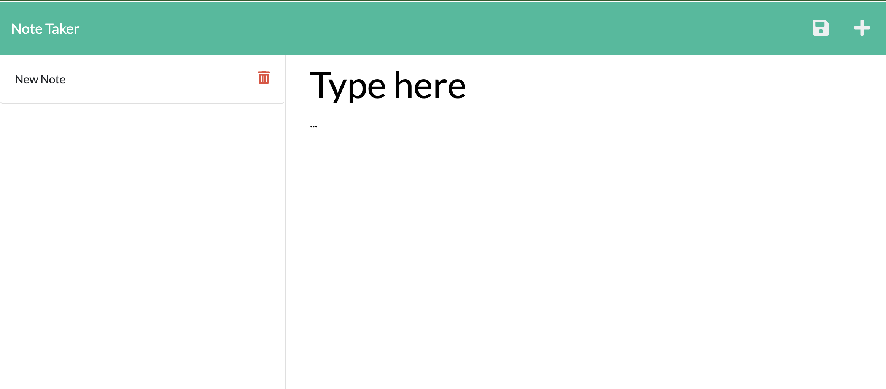

# Note Taker Application

  ## Table of Contents
  
  - i. [Description](#description)
  - ii. [General Information](#general-information)
    - i. [Installation](#installation)
    - ii. [Usage](#usage)
  - iii. [Link and Screenshot](#link-and-screenshot)
  - iv. [Acknowledgements](#acknowledgments)

  ## Description
  
  This is an application where you can get, save, and delete notes using the Express Server in Node js. This application was deployed with Heroku.

  ## General Information
  
  ### Installation
  
  To install the necessary dependencies, run the following command:
  
  ```npm i```

  The neccessary dependencies--Express and uiudv4--should install with this command, assuming you downloaded the package.json file correctly. 

  ### Usage 

  This repo requires both the Express and uiudv4 modules to run correctly. Express is module that allows you to create HTTP routes in your code to fetch and alter information on the server. uuidv4 creates v4 UUIDs, which helps your code identify specific notes in your code to act upon them. 
  
  More documentation on the uuidv4 module below:
  
  [https://www.npmjs.com/package/uuidv4](https://www.npmjs.com/package/uuidv4)

  ## Link and Screenshot

[Deployed Link](https://enigmatic-wildwood-98323.herokuapp.com/)



## Acknowledgements

Special thanks to [Brett M](https://www.youtube.com/@brettm9) for helping me learn how to use the delete method in his [YouTube video](https://www.youtube.com/watch?v=K9jTQPb0Xso).
  
Thank you also to my classmate Adam [(GitHub linked here)](https://github.com/Variegatedhuman) who helped nudge me in the correct direction by pointing out that the post method is conducted by grabbing the id of each note and also introducing me to the uuidv4 module. 
